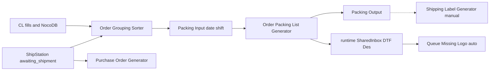

# Warehouse architecture

Detailed reference. Always-on principles: `.cursor/rules/architecture.mdc`. Parent map and proven joins: [`AGENTS.md`](../AGENTS.md). Standing terms: `.cursor/rules/supervisor-chat.mdc`.

## Pipeline

1. **Catalog** — Custom Label fills and NocoDB against `database/shared/custom_label/Custom_Label_Database.csv`.
2. **Sorter** — ShipStation `awaiting_shipment` → process CSVs into Packing `Input/{DD-MM-YYYY}/1st Shift/` (testing). Fixed batches `B80` / `B100` / …; leftover `B1` / `B2` / …; plus `RESEND` and `UNMATCHED`.
3. **Packing** — Input CSVs → app `Output/` plus `runtime/SharedInbox/DTF Des/{date}/{shift}/`.
4. **Queue** — SharedInbox Missing Logo auto-watcher (no approval).
5. **Shipping** — manual only from app `DTF Des Files/` (does not auto-read SharedInbox yet).
6. **Purchase Order Generator** — parallel: tags → BTC stock → packing slips under `output/`.

## Per app

### Custom Label Database

- **Owns:** catalog policy; fill scripts; NocoDB sync; Database Transfer mirror sync after fill.
- **Reads/writes:** live CL CSV via `shared.paths`; helpers under `database/custom-label-database/`; BTC/Uneek/Absolute product data (read).
- **Must not:** invent ShipStation joins; rewrite Apparel Image names; own Packing/Queue/Shipping run I/O.

### Order Grouping Sorter

- **Owns:** grouping run (dry-run default); `database/order-grouping-sorter/` criteria (taxonomy pick-lists, fixed/leftover batches).
- **Reads:** ShipStation `awaiting_shipment`; CL + Plain + Packs (read-only on a run).
- **Writes:** Packing Input CSVs on `--run`; leftover criteria CSV per run date; Logs.
- **Must not:** import Packing internals; overwrite catalogs on a grouping run.

### Order Packing List Generator

- **Owns:** eight-step packing pipeline; packing PDFs/Excel; SharedInbox DTF Des dual-write; missing-logo holding CSV.
- **Reads:** Input CSVs; CL CSV (enrich today); tags; Workbook / New SKU DB under `database/order-packing-list-generator/`.
- **Must not:** invent CL matches; move secrets into the app alone; strip missing logos after Step 6 naming.

### Production Design Queue Manager

- **Owns:** DTF canvas arrange; GUI modes; SharedInbox Missing Logo auto-watcher.
- **Reads:** SharedInbox / DTF Des; CL CSV print mm; Configuration Workbook pocket overrides.
- **Must not:** treat Size References CSV as live sizes; invent size codes.

### Shipping Label Generator

- **Owns:** convert / print / void flows; local `DTF Des Files/` and Output.
- **Reads:** desfiles; `config/ShipStation/.env` via shared credentials.
- **Must not:** hardcode secrets; use Orders Details as primary input; auto-ingest SharedInbox until built.

### Purchase Order Generator

- **Owns:** tag → stock → slip path today; stock CSVs under `database/purchase-order-generator/`.
- **Reads:** ShipStation by tag; Plain/Packs/CL/BTC/Uneek/Absolute; Tags.
- **Must not:** paste credentials; grow packing-slip work as the long-term home (see not-built).

## Data ownership

| Location | Role |
|----------|------|
| `database/shared/` | CL, Tags, BTC/Uneek/Absolute Product Data, Plain, Packs |
| `database/<app-slug>/` | Per-app DB (sorter criteria, packing workbook, queue config workbook, PO stock, CL support) |
| `runtime/` | SharedInbox only |
| `config/ShipStation/` | Secrets |
| Each app folder | Run I/O (`Input`/`Output`/`Logs`, assets, GUI settings) |

All path resolution: `shared/paths.py`.

## Proven joins

Single source of truth: parent [`AGENTS.md`](../AGENTS.md) section **Join points (proven)**. Do not copy or invent joins here.

## Approval

No live DB/CSV/Output/void/print/fill without supervisor **yes / do it / fill / run**.

**Only automatic exception:** Queue SharedInbox Missing Logo watcher. No new exceptions without supervisor approval.

## Not built — do not implement

Until the supervisor asks:

- Shipping auto-read of SharedInbox
- Packing owns **all** packing-list PDFs (including today’s PO slips)
- Packing enrich/preflight from Plain + Packs (do not clone those SKUs into CL)
- PO narrowed to EDI/stock only

## Layers and 200-line policy

See `.cursor/rules/architecture.mdc`. Summary:

- Keep orchestration, domain, data access, integrations, file generation, and validation separate when practical.
- New/modified `.py`/`.ps1`/`.bat`/`.js` ≤ **200** physical lines (tests included). Exempt: `Versions/`, `backups/`, `__pycache__`, data, `.md`/`.mdc`.
- **Legacy ratchet:** oversize files may not grow; extract only the touched responsibility into a cohesive same-app module.
- Checker: `python scripts/check_line_limit.py` (paths optional). Exempt: `Versions/`, `backups/`, `__pycache__`, and `Custom Label Database/docs/archive/**` (incl. `download-images.ps1`).

## Legacy size inventory

**Cleared 2026-10-01:** `python scripts/check_line_limit.py` reports **0** live overs. Oversized monoliths were split into ≤200 cohesive modules behind stable façades (same public import names). Historical snapshot (112 overs as of 2026-09-30) is obsolete — do not use those line counts as current structure.

Pattern after the ratchet:

| Area | Façade / entry | Helpers (examples) |
|------|----------------|--------------------|
| PO stock validate | `run_script_impl1.py` → `run_stock_validate.py` | `run_stock_pack.py`, `run_stock_single.py`, `run_stock_issue_rows.py` |
| PO CSV export | `shipstation_orders.py` → `shipstation_orders_export.py` | `shipstation_orders_csv_flatten.py`, `shipstation_orders_item.py` |
| Queue missing-logo / personalised GUI | `gui_processing_ui_*.py` | `*_load.py`, `gui_processing_core_*.py` |
| Queue console logging | `src/system/logging/console.py` | `console_setup.py`, `console_close.py`, `console_state.py` |
| Queue Missing Logo watcher | `auto_missing_logo_watcher.py` | `auto_missing_logo_{process,loop,inbox}.py` |
| Packing PDF runtime | `runtime_api.py` | `runtime_api_bind{,_a,_b}.py`, draw/reporting modules |
| Shipping print flow | `process_order.py`, `read_group.py` | `process_order_impl*`, `read_group_impl.py` |
