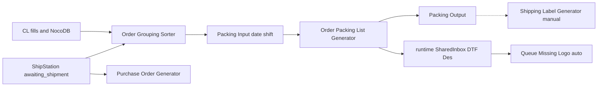

# Warehouse architecture

Detailed reference. Always-on principles: `.cursor/rules/architecture.mdc`. Parent map and proven joins: [`AGENTS.md`](../AGENTS.md). Standing terms: `.cursor/rules/supervisor-chat.mdc`.

## Pipeline

1. **Catalog** — Custom Label fills and NocoDB against `database/shared/custom_label/Custom_Label_Database.csv`.
2. **Sorter** — ShipStation `awaiting_shipment` → process CSVs into Packing `Input/{DD-MM-YYYY}/1st Shift/` (testing). Fixed batches `B80` / `B100` / …; leftover `B1` / `B2` / …; plus `RESEND` and `UNMATCHED`.
3. **Packing** — Input CSVs → app `Output/` plus `runtime/SharedInbox/DTF Des/{date}/{shift}/`.
4. **Queue** — SharedInbox Missing Logo auto-watcher (no approval).
5. **Shipping** — manual only from app `DTF Des Files/` (does not auto-read SharedInbox yet).
6. **Purchase Order Generator** — parallel: tags → BTC stock → packing slips under `output/`.

## Per app

### Custom Label Database

- **Owns:** catalog policy; fill scripts; NocoDB sync; Database Transfer mirror sync after fill.
- **Reads/writes:** live CL CSV via `shared.paths`; helpers under `database/custom-label-database/`; BTC/Uneek/Absolute product data (read).
- **Must not:** invent ShipStation joins; rewrite Apparel Image names; own Packing/Queue/Shipping run I/O.

### Order Grouping Sorter

- **Owns:** grouping run (dry-run default); `database/order-grouping-sorter/` criteria (taxonomy pick-lists, fixed/leftover batches).
- **Reads:** ShipStation `awaiting_shipment`; CL + Plain + Packs (read-only on a run).
- **Writes:** Packing Input CSVs on `--run`; leftover criteria CSV per run date; Logs.
- **Must not:** import Packing internals; overwrite catalogs on a grouping run.

### Order Packing List Generator

- **Owns:** eight-step packing pipeline; packing PDFs/Excel; SharedInbox DTF Des dual-write; missing-logo holding CSV.
- **Reads:** Input CSVs; CL CSV (enrich today); tags; Workbook / New SKU DB under `database/order-packing-list-generator/`.
- **Must not:** invent CL matches; move secrets into the app alone; strip missing logos after Step 6 naming.

### Production Design Queue Manager

- **Owns:** DTF canvas arrange; GUI modes; SharedInbox Missing Logo auto-watcher.
- **Reads:** SharedInbox / DTF Des; CL CSV print mm; Configuration Workbook pocket overrides.
- **Must not:** treat Size References CSV as live sizes; invent size codes.

### Shipping Label Generator

- **Owns:** convert / print / void flows; local `DTF Des Files/` and Output.
- **Reads:** desfiles; `config/ShipStation/.env` via shared credentials.
- **Must not:** hardcode secrets; use Orders Details as primary input; auto-ingest SharedInbox until built.

### Purchase Order Generator

- **Owns:** tag → stock → slip path today; stock CSVs under `database/purchase-order-generator/`.
- **Reads:** ShipStation by tag; Plain/Packs/CL/BTC/Uneek/Absolute; Tags.
- **Must not:** paste credentials; grow packing-slip work as the long-term home (see not-built).

## Data ownership

| Location | Role |
|----------|------|
| `database/shared/` | CL, Tags, BTC/Uneek/Absolute Product Data, Plain, Packs |
| `database/<app-slug>/` | Per-app DB (sorter criteria, packing workbook, queue config workbook, PO stock, CL support) |
| `runtime/` | SharedInbox only |
| `config/ShipStation/` | Secrets |
| Each app folder | Run I/O (`Input`/`Output`/`Logs`, assets, GUI settings) |

All path resolution: `shared/paths.py`.

## Proven joins

Single source of truth: parent [`AGENTS.md`](../AGENTS.md) section **Join points (proven)**. Do not copy or invent joins here.

## Approval

No live DB/CSV/Output/void/print/fill without supervisor **yes / do it / fill / run**.

**Only automatic exception:** Queue SharedInbox Missing Logo watcher. No new exceptions without supervisor approval.

## Not built — do not implement

Until the supervisor asks:

- Shipping auto-read of SharedInbox
- Packing owns **all** packing-list PDFs (including today’s PO slips)
- Packing enrich/preflight from Plain + Packs (do not clone those SKUs into CL)
- PO narrowed to EDI/stock only

## Layers and 200-line policy

See `.cursor/rules/architecture.mdc`. Summary:

- Keep orchestration, domain, data access, integrations, file generation, and validation separate when practical.
- New/modified `.py`/`.ps1`/`.bat`/`.js` ≤ **200** physical lines (tests included). Exempt: `Versions/`, `backups/`, `__pycache__`, data, `.md`/`.mdc`.
- **Legacy ratchet:** oversize files may not grow; extract only the touched responsibility into a cohesive same-app module.
- Checker: `python scripts/check_line_limit.py` (paths optional).

## Legacy size inventory

Record of the problem (112 live source files over 200 lines as of 2026-09-30). **Not** a split schedule. Top offenders: `grouping.py` (1483), `fill_from_seeds.py` (1478), `run_script.py` (1307), `areeb_taxonomy.py` (1282), `test_grouping.py` (1265), `add_labels.py` (1121).

### Order Grouping Sorter

| Lines | Path | Mixed responsibilities (one line) |
|------:|------|-------------------------------------|
| 1483 | `Order Grouping Sorter/scripts/grouping.py` | intake, finish/attrs, fixed-batch match, peel chain, naming, CSV write, report |
| 1265 | `Order Grouping Sorter/scripts/test_grouping.py` | oversized test suite — split by behaviour |

### Custom Label Database

| Lines | Path | Mixed responsibilities (one line) |
|------:|------|-------------------------------------|
| 479 | `Custom Label Database/scripts/generate_from_mocks.py` | mixed responsibilities — see filename |
| 361 | `Custom Label Database/scripts/print_sizes_simulation.py` | mixed responsibilities — see filename |
| 333 | `Custom Label Database/scripts/db_update.py` | mixed responsibilities — see filename |
| 301 | `Custom Label Database/scripts/download_apparel_images.py` | mixed responsibilities — see filename |
| 283 | `Custom Label Database/docs/archive/maker/download-images.ps1` | mixed responsibilities — see filename |
| 265 | `Custom Label Database/scripts/import_uneek_product_data.py` | mixed responsibilities — see filename |
| 264 | `Custom Label Database/scripts/phase1_cleanup.py` | CL maintenance/cleanup phase |
| 250 | `Custom Label Database/scripts/rewrite_front_print_a4_from_shirts.py` | mixed responsibilities — see filename |
| 244 | `Custom Label Database/scripts/phase3_cleanup.py` | CL maintenance/cleanup phase |
| 241 | `Custom Label Database/scripts/phase4_cleanup.py` | CL maintenance/cleanup phase |
| 235 | `Custom Label Database/scripts/print_sizes_mock_analysis.py` | mixed responsibilities — see filename |
| 227 | `Custom Label Database/scripts/print_sizes_analysis.py` | mixed responsibilities — see filename |
| 222 | `Custom Label Database/scripts/fill_cl_database.py` | catalog fill script |
| 212 | `Custom Label Database/scripts/phase2_cleanup.py` | CL maintenance/cleanup phase |
| 205 | `Custom Label Database/scripts/_probe_sr_contain.py` | mixed responsibilities — see filename |

### shared

| Lines | Path | Mixed responsibilities (one line) |
|------:|------|-------------------------------------|
| 1282 | `shared/areeb_taxonomy.py` | Areeb classify rules + tables for CL/Plain/Packs |
| 900 | `shared/taxonomy_catalog.py` | Hashim #038 pick-list source + rebuild helpers |
| 494 | `shared/paths.py` | warehouse path registry (all apps) |
| 261 | `shared/supply_method.py` | Warehouse Stock / In House / On Demand rules |
| 260 | `shared/shipstation/sync_client.py` | ShipStation sync client |

### Purchase Order Generator

| Lines | Path | Mixed responsibilities (one line) |
|------:|------|-------------------------------------|
| 1307 | `Purchase Order Generator/scripts/run_script.py` | PO orchestration: tags, stock resolve, slip generation |
| 883 | `Purchase Order Generator/scripts/pdf_generator.py` | PO packing-slip PDF layout/generation |
| 522 | `Purchase Order Generator/scripts/shipstation_orders.py` | PO ShipStation tag/order fetch |
| 503 | `Purchase Order Generator/scripts/run_script_gui.py` | GUI orchestration/helpers |
| 464 | `Purchase Order Generator/tests/test_validate_orders_stock.py` | oversized test suite — split by behaviour |
| 364 | `Purchase Order Generator/scripts/fill_btc_stock_id.py` | catalog fill script |
| 251 | `Purchase Order Generator/scripts/download_product_images.py` | mixed responsibilities — see filename |
| 237 | `Purchase Order Generator/scripts/sync_database_from_btc_product_data.py` | integration / sync |
| 224 | `Purchase Order Generator/scripts/extract_not_found_skus.py` | mixed responsibilities — see filename |

### Order Packing List Generator

| Lines | Path | Mixed responsibilities (one line) |
|------:|------|-------------------------------------|
| 859 | `Order Packing List Generator/scripts/pipeline_preflight_issues/app.py` | preflight GUI + issue orchestration |
| 784 | `Order Packing List Generator/scripts/pipeline_packing_list_app/runner.py` | packing GUI/pipeline runner glue |
| 654 | `Order Packing List Generator/scripts/pipeline_generate_packing_list_pdf/reporting.py` | packing PDF reporting helpers |
| 547 | `Order Packing List Generator/scripts/pipeline_runtime/runner.py` | eight-step packing pipeline orchestration |
| 528 | `Order Packing List Generator/scripts/pipeline_packing_list_app/app.py` | packing list GUI app shell |
| 522 | `Order Packing List Generator/scripts/gui_theme.py` | packing GUI theme/styling |
| 461 | `Order Packing List Generator/scripts/pipeline_generate_packing_list_pdf/draw_page_apparel_and_logos.py` | PDF/drawing generation |
| 436 | `Order Packing List Generator/scripts/pipeline_preflight_issues/image_dry_run.py` | mixed responsibilities — see filename |
| 418 | `Order Packing List Generator/scripts/pipeline_runtime/runner_utils.py` | mixed responsibilities — see filename |
| 404 | `Order Packing List Generator/scripts/pipeline_generate_packing_list_pdf/image_lookup.py` | PDF/drawing generation |
| 399 | `Order Packing List Generator/scripts/pipeline_preflight_issues/service.py` | mixed responsibilities — see filename |
| 393 | `Order Packing List Generator/scripts/pipeline_packing_list_app/ui.py` | mixed responsibilities — see filename |
| 356 | `Order Packing List Generator/scripts/pipeline_missing_run_app/gui.py` | GUI orchestration/helpers |
| 301 | `Order Packing List Generator/scripts/pipeline_cl_lookup/enrich_cl_lookup.py` | mixed responsibilities — see filename |
| 298 | `Order Packing List Generator/scripts/pipeline_generate_packing_list_pdf/draw_page_impl.py` | PDF/drawing generation |
| 292 | `Order Packing List Generator/scripts/pipeline_runtime/runner_step8_pdf.py` | PDF/drawing generation |
| 279 | `Order Packing List Generator/scripts/pipeline_generate_packing_list_pdf/runtime_api.py` | PDF/drawing generation |
| 273 | `Order Packing List Generator/scripts/pipeline_shipstation/sync_tags_xlsx.py` | integration / sync |
| 270 | `Order Packing List Generator/scripts/pipeline_runtime/runner_step6_outputs.py` | mixed responsibilities — see filename |
| 260 | `Order Packing List Generator/tests/test_merge_group_exclusion.py` | oversized test suite — split by behaviour |
| 246 | `Order Packing List Generator/scripts/pipeline_generate_packing_list_pdf/draw_text.py` | PDF/drawing generation |
| 238 | `Order Packing List Generator/scripts/pipeline_generate_excel_outputs/writers.py` | Excel/CSV output writers |
| 234 | `Order Packing List Generator/scripts/pipeline_shipstation/orders_to_csv.py` | integration / sync |
| 234 | `Order Packing List Generator/scripts/pipeline_assign_process_number/service.py` | mixed responsibilities — see filename |
| 229 | `Order Packing List Generator/tests/test_back_print_hint.py` | oversized test suite — split by behaviour |
| 228 | `Order Packing List Generator/tests/test_duplicate_order_suffixes.py` | oversized test suite — split by behaviour |
| 227 | `Order Packing List Generator/scripts/pipeline_shipstation/tags_process_lookup.py` | integration / sync |
| 226 | `Order Packing List Generator/tests/test_tags_process_lookup.py` | oversized test suite — split by behaviour |
| 226 | `Order Packing List Generator/scripts/pipeline_split_by_process_item/common.py` | mixed responsibilities — see filename |
| 225 | `Order Packing List Generator/scripts/pipeline_generate_packing_list_pdf/back_print_hint.py` | PDF/drawing generation |
| 222 | `Order Packing List Generator/scripts/pipeline_missing_run_app/core.py` | mixed responsibilities — see filename |
| 220 | `Order Packing List Generator/scripts/pipeline_generate_excel_outputs/helpers.py` | Excel/CSV output writers |
| 211 | `Order Packing List Generator/tests/test_generate_packing_list_pdf_parity.py` | oversized test suite — split by behaviour |
| 202 | `Order Packing List Generator/tests/test_enrich_cl_lookup_customise.py` | oversized test suite — split by behaviour |
| 202 | `Order Packing List Generator/scripts/pipeline_generate_packing_list_pdf/draw_page_overlays.py` | PDF/drawing generation |

### Shipping Label Generator

| Lines | Path | Mixed responsibilities (one line) |
|------:|------|-------------------------------------|
| 797 | `Shipping Label Generator/scripts/app/flows/print_labels/run.py` | shipping print-labels flow orchestration |
| 737 | `Shipping Label Generator/scripts/app/flows/print_labels/process_order.py` | per-order label create/reuse path |
| 526 | `Shipping Label Generator/scripts/app/providers/real/provider.py` | ShipStation real provider integration |
| 487 | `Shipping Label Generator/tests/test_real_provider.py` | oversized test suite — split by behaviour |
| 457 | `Shipping Label Generator/scripts/app/flows/label_report/run.py` | shipping label report flow |
| 304 | `Shipping Label Generator/scripts/app/pdf/report_pages.py` | PDF/drawing generation |
| 248 | `Shipping Label Generator/scripts/app/logging/jsonl.py` | mixed responsibilities — see filename |
| 224 | `Shipping Label Generator/scripts/app/flows/convert/run.py` | mixed responsibilities — see filename |
| 209 | `Shipping Label Generator/scripts/app/util/retries.py` | mixed responsibilities — see filename |
| 205 | `Shipping Label Generator/scripts/app/flows/amendments/shipstation_tags.py` | integration / sync |
| 204 | `Shipping Label Generator/scripts/app/flows/print_labels/read_group.py` | mixed responsibilities — see filename |

### Production Design Queue Manager

| Lines | Path | Mixed responsibilities (one line) |
|------:|------|-------------------------------------|
| 437 | `Production Design Queue Manager/scripts/src/core/canvas_arranger.py` | DTF canvas pack/arrange domain |
| 435 | `Production Design Queue Manager/queue_app.py` | Queue GUI entry + mode orchestration |
| 428 | `Production Design Queue Manager/scripts/src/core/size_code_extractor.py` | mixed responsibilities — see filename |
| 422 | `Production Design Queue Manager/scripts/test_sku_position_hints.py` | oversized test suite — split by behaviour |
| 404 | `Production Design Queue Manager/scripts/auto_missing_logo_watcher.py` | SharedInbox Missing Logo watcher |
| 361 | `Production Design Queue Manager/scripts/gui_helpers/canvas/gui_ui_builder_impl.py` | GUI orchestration/helpers |
| 359 | `Production Design Queue Manager/scripts/src/io/file_loaders.py` | mixed responsibilities — see filename |
| 358 | `Production Design Queue Manager/scripts/src/io/vba_file_search_core.py` | mixed responsibilities — see filename |
| 284 | `Production Design Queue Manager/scripts/gui_helpers/common/gui_common.py` | GUI orchestration/helpers |
| 275 | `Production Design Queue Manager/scripts/gui_helpers/canvas/gui_components.py` | GUI orchestration/helpers |
| 249 | `Production Design Queue Manager/scripts/gui_helpers/canvas/gui_save.py` | GUI orchestration/helpers |
| 246 | `Production Design Queue Manager/scripts/src/core/image_orientation.py` | mixed responsibilities — see filename |
| 245 | `Production Design Queue Manager/scripts/src/core/image_resizing.py` | mixed responsibilities — see filename |
| 241 | `Production Design Queue Manager/scripts/src/system/logging/console.py` | mixed responsibilities — see filename |
| 229 | `Production Design Queue Manager/scripts/src/core/size_reference.py` | mixed responsibilities — see filename |
| 224 | `Production Design Queue Manager/scripts/gui_helpers/processing/gui_processing_ui_missing_logo.py` | GUI orchestration/helpers |
| 222 | `Production Design Queue Manager/scripts/src/io/rar_utils.py` | mixed responsibilities — see filename |
| 221 | `Production Design Queue Manager/scripts/gui_helpers/processing/gui_processing_folder.py` | GUI orchestration/helpers |
| 218 | `Production Design Queue Manager/scripts/gui_helpers/selection/gui_file_selection.py` | GUI orchestration/helpers |
| 213 | `Production Design Queue Manager/scripts/src/system/di_container.py` | mixed responsibilities — see filename |
| 208 | `Production Design Queue Manager/scripts/gui_helpers/processing/gui_processing_ui_personalised.py` | GUI orchestration/helpers |
| 206 | `Production Design Queue Manager/scripts/src/system/settings_manager.py` | mixed responsibilities — see filename |
| 202 | `Production Design Queue Manager/scripts/src/core/multi_position_logic.py` | mixed responsibilities — see filename |

### root-scripts

| Lines | Path | Mixed responsibilities (one line) |
|------:|------|-------------------------------------|
| 475 | `scripts/fill_areeb_taxonomy.py` | catalog fill script |
| 298 | `scripts/test_fill_areeb_taxonomy.py` | oversized test suite — split by behaviour |
| 270 | `scripts/write_order_grouping_progress.py` | mixed responsibilities — see filename |
| 234 | `scripts/test_supply_method.py` | oversized test suite — split by behaviour |
| 225 | `scripts/fix_cl_btc_leaked_shipping.py` | mixed responsibilities — see filename |
| 215 | `scripts/fill_supplier_name.py` | catalog fill script |
| 206 | `scripts/fill_supply_method.py` | catalog fill script |
